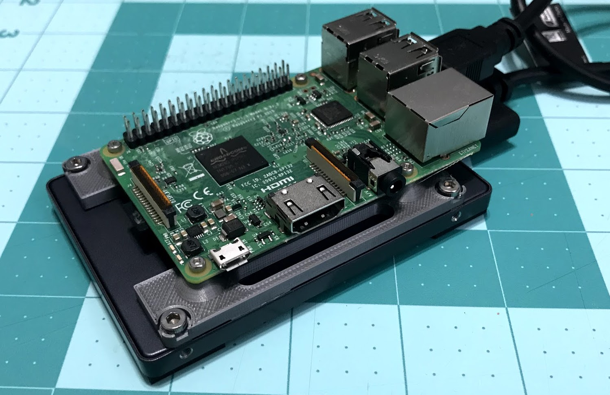

# Raspberry Pi Server

## Hardware

The design uses [openscad](www.openscad.org) for the design of the bracket.
You can use any slicer to generate gcode and print the bracket

- 3d printer and any color PLA
- M2-0.5 x 8mm screws and nuts for the raspberry pi
    - to get the nuts in the cut out, you can use the pull through method, since
    they are sized as a press fit (meaning very tight). I used a 12mm screw
    to pull the nuts through
- M3-0.5 x 6mm screws for the hard drive
- raspberry pi, hard drive, USB-to-SATA adaptor
    - I use a Startech cable I got from Amazon
    - I use an SSD because it is low power, a spinning disk might cause brown outs for you pi
- [PiOLED 128x32 display](https://www.adafruit.com/product/3527)
    - This is not necessary, but it is nice to display server name/address/performance
    - `sudo i2cdetect -y 1` should show the display at `0x3C`

## Software

There is nothing here you really need

- [mote](https://github.com/MomsFriendlyRobotCompany/mote) for setting up the
command line, web server (node), and file sharing (samba)
- PiOLED is in the software folder
- [Plex](https://www.plex.tv/) maintains a version for Raspberry Pi, so you can 

## Changes

- **Version 4**
    - Using all metric M2 and M3 screws now
    - Cut out the front so you can get to the SD card easier
    - Embedded nuts in the design, so they aren't sticking up on the top
    - Updated the LCD script
        - Linux release name
        - Added kernel version
        - Heartbeat is only 1 character now
- **Version 3**
    - Raised the pi up higher on the pillars
    - Centered the pi in the middle of the bracket
    - Skeletonize the design so it doesn't use so much plastic
- **Version 2**
    - Added a script for Adafruit's LCD

# MIT License

**Copyright (c) 2018 Kevin Walchko**

Permission is hereby granted, free of charge, to any person obtaining a copy
of this software and associated documentation files (the "Software"), to deal
in the Software without restriction, including without limitation the rights
to use, copy, modify, merge, publish, distribute, sublicense, and/or sell
copies of the Software, and to permit persons to whom the Software is
furnished to do so, subject to the following conditions:

The above copyright notice and this permission notice shall be included in all
copies or substantial portions of the Software.

THE SOFTWARE IS PROVIDED "AS IS", WITHOUT WARRANTY OF ANY KIND, EXPRESS OR
IMPLIED, INCLUDING BUT NOT LIMITED TO THE WARRANTIES OF MERCHANTABILITY,
FITNESS FOR A PARTICULAR PURPOSE AND NONINFRINGEMENT. IN NO EVENT SHALL THE
AUTHORS OR COPYRIGHT HOLDERS BE LIABLE FOR ANY CLAIM, DAMAGES OR OTHER
LIABILITY, WHETHER IN AN ACTION OF CONTRACT, TORT OR OTHERWISE, ARISING FROM,
OUT OF OR IN CONNECTION WITH THE SOFTWARE OR THE USE OR OTHER DEALINGS IN THE
SOFTWARE.
