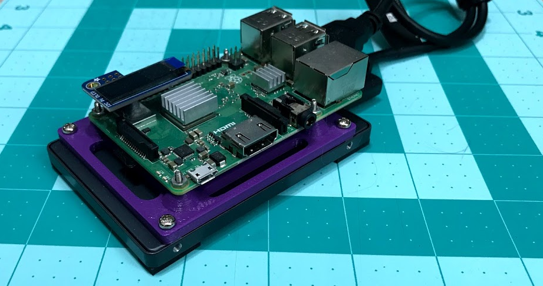

# Raspberry Pi Server

## Hardware

The design uses [openscad](www.openscad.org) for the design of the bracket.
You can use any slicer to generate gcode and print the bracket

- 3d printer and any color PLA
- M2-0.5 x 8 screws and nuts for the raspberry pi
    - to get the nuts in the cut out, you can use the pull through method, since
    they are sized as a press fit (meaning very tight). I used a 12 mm screw
    to pull the nuts through
- M3-0.5 x 6 screws for the hard drive
- raspberry pi, hard drive, USB-to-SATA adaptor
- [PiOLED 128x32 display](https://www.adafruit.com/product/3527)

## Software

- [mote](https://github.com/MomsFriendlyRobotCompany/mote) for setting up the
command line, web server (node), and file sharing (samba)
- PiOLED is in the software folder

# MIT License

**Copyright (c) 2019 Kevin Walchko**

Permission is hereby granted, free of charge, to any person obtaining a copy
of this software and associated documentation files (the "Software"), to deal
in the Software without restriction, including without limitation the rights
to use, copy, modify, merge, publish, distribute, sublicense, and/or sell
copies of the Software, and to permit persons to whom the Software is
furnished to do so, subject to the following conditions:

The above copyright notice and this permission notice shall be included in all
copies or substantial portions of the Software.

THE SOFTWARE IS PROVIDED "AS IS", WITHOUT WARRANTY OF ANY KIND, EXPRESS OR
IMPLIED, INCLUDING BUT NOT LIMITED TO THE WARRANTIES OF MERCHANTABILITY,
FITNESS FOR A PARTICULAR PURPOSE AND NONINFRINGEMENT. IN NO EVENT SHALL THE
AUTHORS OR COPYRIGHT HOLDERS BE LIABLE FOR ANY CLAIM, DAMAGES OR OTHER
LIABILITY, WHETHER IN AN ACTION OF CONTRACT, TORT OR OTHERWISE, ARISING FROM,
OUT OF OR IN CONNECTION WITH THE SOFTWARE OR THE USE OR OTHER DEALINGS IN THE
SOFTWARE.
